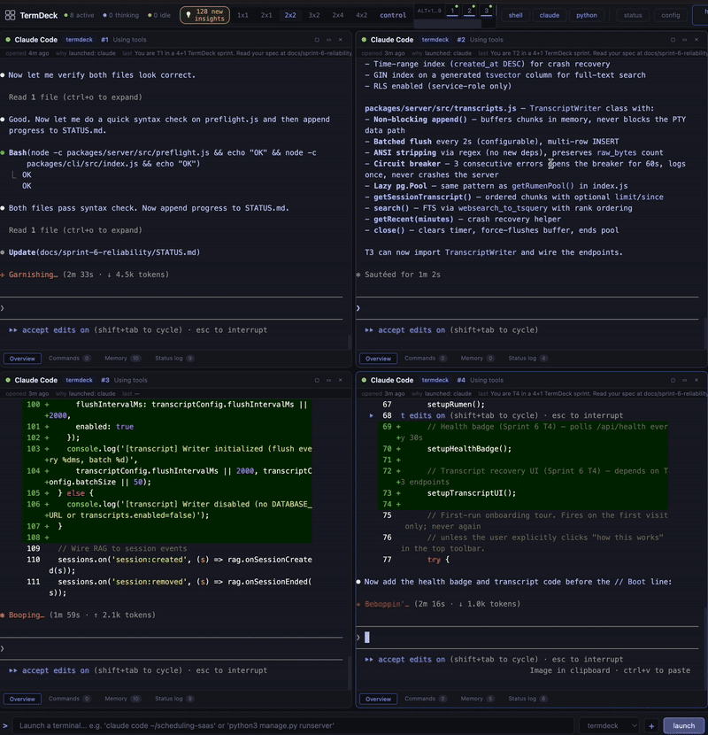

# TermDeck

> **The terminal that remembers what you fixed last month.**

A browser-based terminal multiplexer with an onboarding tour, rich per-panel metadata, and **Flashback** — automatic recall of similar past errors, surfaced the moment a panel hits a problem. No asking, no querying, no manual search. TermDeck notices you're stuck and offers the memory.



---

## One command to try it

```bash
npx @jhizzard/termdeck
```

Ninety seconds, one command. Node 18+ is all you need — prebuilt binaries mean no C++ toolchain. Your browser opens automatically at `http://127.0.0.1:3000`, an onboarding tour walks you through every button, and you're launching real PTY shells, Claude Code, Python servers, or anything else a normal terminal can run.

This is **Tier 1**. Works immediately, fully local, no accounts, no credentials, no database. You get the full dashboard — 7 grid layouts, 8 themes, per-panel metadata overlays, terminal switcher, reply button, status logs, session history in local SQLite. **Flashback is silent at this tier** because there's no memory store to query.

First-time user? The **config** button in the toolbar shows what's set up and what's next — click it for a live view of each tier's status with guided next steps.

Enabling Flashback takes **one additional 15-minute setup step** — see Tier 2 below. The rest of this README explains what you get, how it works, and how to go deeper.

### Want the whole stack in one command?

```bash
npx @jhizzard/termdeck-stack
```

The meta-installer prints a layered overview of the four packages (TermDeck + Mnestra + Rumen + Supabase MCP), detects what's already on your machine, asks which tier you want, runs `npm install -g` for the missing pieces, and merges Mnestra + Supabase MCP entries into `~/.claude/mcp.json`. See [packages/stack-installer/README.md](packages/stack-installer/README.md) for details, or `npx @jhizzard/termdeck-stack --help`.

---

## Documentation hierarchy

- **This README** — quickstart, pitch, and links
- **[docs/GETTING-STARTED.md](docs/GETTING-STARTED.md)** — full 4-tier installation guide
- **[termdeck-docs.vercel.app](https://termdeck-docs.vercel.app)** — reference docs (Astro/Starlight)
- **docs/launch/** — launch collateral (Show HN, Twitter, etc.)
- **docs/sprint-N-*/** — historical sprint logs (append-only, not maintained post-sprint)

---

## How Flashback works

When a panel's status transitions to `errored`, the server's output analyzer fires an event. The mnestra bridge takes the session context (type, project, last command, error tail) and queries your Mnestra memory store for the top similar match. If it finds one above the relevance threshold, the result is pushed to the panel's WebSocket as a `proactive_memory` message. The client renders it as a toast anchored to the panel, showing the match's project tag, source type, similarity score, and content snippet. You click the toast to expand into the Memory tab of that panel's drawer.

Rate-limited to once per 30 seconds per panel. Needs RAG enabled and credentials configured (Tier 2+). Fires on **any** terminal panel — shell, Claude Code, Python server, anything.

---

## The three-tier stack

TermDeck is one piece of a three-tier memory stack. Each tier adds capability; each tier is optional.

| Tier | Install time | What you get |
|---|---|---|
| **1 — TermDeck alone** | 90 seconds | Full multiplexer, metadata, layouts, themes, tour, session history, command logging. Flashback silent. |
| **2 — + Mnestra memory store** | ~15 minutes | Flashback actively fires. Cross-session recall. "Ask about this terminal" queries real memories. Optional Mnestra-as-MCP for Claude Code / Cursor / Windsurf. |
| **3 — + Rumen async learning** | ~30 minutes | Async learning layer runs on a cron, synthesizes insights across projects, writes them back into Mnestra. Flashback starts surfacing cross-project patterns, not just direct matches. |

### Tier 1 — `npx @jhizzard/termdeck` (you're here)

What's included:

- Real PTY shells in the browser via `@homebridge/node-pty-prebuilt-multiarch`
- 7 grid layouts (`1x1`, `2x1`, `2x2`, `3x2`, `2x4`, `4x2`, control-room feed)
- 8 curated xterm.js themes (Tokyo Night, Catppuccin Mocha, Rosé Pine Dawn, Dracula, Nord, Gruvbox Dark, Solarized Dark, GitHub Light) — per-panel, switchable live
- Rich panel metadata: project tag, session type, status dot, detected port, last command, request count, `#N` suffix for same-project duplicates
- Per-panel drawer with four tabs: Overview, Commands (history), Memory (Flashback hits), Status log
- Reply button to route text from one panel to another
- Terminal switcher (`Option+1..9` on macOS, `Alt+1..9` elsewhere)
- Layout keyboard shortcuts (`Cmd+Shift+1..6` on macOS)
- Interactive onboarding tour (13 steps, auto-fires on first visit, replayable from the `how this works` button)
- Add-project modal — create a new project entry from the UI without hand-editing yaml
- Local SQLite persistence for sessions, command history, and RAG events
- Optional session log markdown files on PTY exit (enable with `--session-logs`)

What's excluded at this tier: **Flashback is silent**, the "Ask about this terminal" input returns nothing, and no memories are surfaced. All other features work.

### Tier 2 — Add Mnestra to light up Flashback

Mnestra is a separate npm package — `@jhizzard/mnestra@0.2.0` — that ships a Postgres-backed persistent memory store with an MCP server, a webhook server, six search tools, and six SQL migrations. It can be consumed by TermDeck (for Flashback), by Claude Code (as an MCP memory layer), or by any tool that speaks the MCP protocol.

To enable Flashback in TermDeck:

1. **Provision Postgres with pgvector.** Easiest: create a free Supabase project at supabase.com. Copy the **Project URL** and the **service_role key** from Project Settings → API.
2. **Apply Mnestra's migrations** to the database. Run each in order via the Supabase SQL Editor, or via `psql`:
   ```bash
   npm install -g @jhizzard/mnestra
   psql "$DATABASE_URL" -f node_modules/@jhizzard/mnestra/migrations/001_mnestra_tables.sql
   psql "$DATABASE_URL" -f node_modules/@jhizzard/mnestra/migrations/002_mnestra_search_function.sql
   psql "$DATABASE_URL" -f node_modules/@jhizzard/mnestra/migrations/003_mnestra_event_webhook.sql
   psql "$DATABASE_URL" -f node_modules/@jhizzard/mnestra/migrations/004_mnestra_match_count_cap_and_explain.sql
   psql "$DATABASE_URL" -f node_modules/@jhizzard/mnestra/migrations/005_v0_1_to_v0_2_upgrade.sql
   psql "$DATABASE_URL" -f node_modules/@jhizzard/mnestra/migrations/006_memory_status_rpc.sql
   ```
3. **Get an OpenAI API key** (text-embedding-3-large).
4. **Create `~/.termdeck/secrets.env`:**
   ```
   SUPABASE_URL=https://your-project.supabase.co
   SUPABASE_SERVICE_ROLE_KEY=sb_secret_...
   OPENAI_API_KEY=sk-proj-...
   ANTHROPIC_API_KEY=sk-ant-...     # optional — enables Haiku session summaries
   ```
5. **Enable RAG in `~/.termdeck/config.yaml`:**
   ```yaml
   rag:
     enabled: true
     supabaseUrl: ${SUPABASE_URL}
     supabaseKey: ${SUPABASE_SERVICE_ROLE_KEY}
     openaiApiKey: ${OPENAI_API_KEY}
     mnestraMode: direct
   ```
6. **Restart TermDeck** (`Ctrl+C`, then `npx @jhizzard/termdeck` again).

Flashback now fires when panels error. Initially your store is empty, so nothing surfaces. As you use TermDeck day-to-day, the output analyzer captures session events, command history, and error contexts — each one becomes a memory. After a few days of real work, Flashback starts surfacing real hits.

### Tier 2 bonus — Mnestra as a Claude Code MCP server

Independently of TermDeck, install Mnestra as an MCP server so Claude Code (and Cursor / Windsurf / Cline / Continue) have persistent memory across sessions pointing at the same database TermDeck uses:

```bash
npm install -g @jhizzard/mnestra
```

Edit `~/.claude/mcp.json`:

```json
{
  "mcpServers": {
    "mnestra": {
      "command": "mnestra",
      "env": {
        "SUPABASE_URL": "https://your-project.supabase.co",
        "SUPABASE_SERVICE_ROLE_KEY": "sb_secret_...",
        "OPENAI_API_KEY": "sk-proj-...",
        "ANTHROPIC_API_KEY": "sk-ant-..."
      }
    }
  }
}
```

Restart Claude Code. Six MCP tools appear: `memory_remember`, `memory_recall`, `memory_search`, `memory_forget`, `memory_status`, `memory_summarize_session`. Your AI assistant can now read and write memories that TermDeck's Flashback will later surface automatically. See [github.com/jhizzard/mnestra](https://github.com/jhizzard/mnestra) for full MCP reference.

### Tier 3 — Add Rumen for async learning

Rumen is a separate npm package — `@jhizzard/rumen@0.4.5` — that ships as a Supabase Edge Function designed to run on a 15-minute `pg_cron` schedule. It's the async reflection layer over Mnestra: it reads recent session memories, cross-references them with your entire historical corpus via hybrid search, synthesizes insights via Claude Haiku, and writes the results back into `rumen_insights` (a new table alongside Mnestra's `memory_items`). TermDeck's Flashback and Claude Code's `memory_recall` both automatically benefit because insights flow back into the same database.

**Rumen is live.** First full-kickstart run against a production Mnestra store on 2026-04-15 19:47 UTC: **111 sessions processed, 111 insights generated** in one pass. Insights surfaced patterns like "the error detection regex in Flashback misses `No such file or directory` — same class of blind spot as X" and "Practice sessions exist as a separate model but frontend components were built and never wired into the schedule view." The cognitive loop is closed.

Deploy with **one command**:

```bash
termdeck init --rumen
```

The wizard auto-resolves the latest published `@jhizzard/rumen` version from npm at deploy time, applies the self-healing SQL migration, stages the Edge Function with the correct version pin, deploys via the Supabase CLI, sets function secrets, applies the `pg_cron` schedule, and POSTs a manual test invocation. Prerequisites: Supabase CLI, Deno, and a `DATABASE_URL` pointing at a Mnestra-compatible Postgres. Full walkthrough including the five setup gotchas (the hidden IPv4 toggle in the Supabase Connect modal, the literal-string password bug, `DATABASE_URL` only / no `DIRECT_URL`, the macOS-13 + Homebrew + Deno incompatibility, and schema drift handling) is at **[rumen/install.md](https://github.com/jhizzard/rumen/blob/main/install.md)**.

**Why you'd want Rumen:** without it, Flashback only surfaces memories that structurally match the current context (same project, similar error). With Rumen, Flashback surfaces **cross-project patterns** that Haiku synthesized while you were away — "the CORS fix you applied in Project A probably solves this error in Project B." That's the moat.

---

## What Flashback is NOT

Honest limits, stated upfront so the skeptic has nothing to chase:

- **Not magic.** It fires on pattern-matched status transitions from the PTY output analyzer (non-zero exits, `Error:` / `Traceback` / `panic:` / `command not found` / similar). If the analyzer misses your error class, no Flashback. Pattern tuning is an ongoing process.
- **Not a replacement for reading docs.** It's the shortest path to a memory you already wrote. If the memory isn't there, the feature does nothing.
- **Not fully local by default.** Tier 2+ reaches out to Supabase for storage and OpenAI for embeddings. Tier 1 is fully local. A fully-local Tier 2 (local Postgres + local embeddings) is on the roadmap.
- **Not free forever.** Tier 2+ pays OpenAI fractions of a cent per memory for embeddings. Self-hosted embeddings via Ollama are on the roadmap.
- **Not proven at scale.** v0.4.5, validated against 3,527 memories in one developer's production store. First full Rumen kickstart on 2026-04-15 processed 111 sessions into 111 insights in one pass. No multi-user data yet. Bug reports and issues welcome.

---

## Architecture at a glance

```
┌─────────────────────────────────────────┐
│  Browser: dashboard + xterm.js panels   │
└─────────────────┬───────────────────────┘
                  │ WebSocket + REST
                  ▼
┌─────────────────────────────────────────┐
│  TermDeck server                        │
│  - Express + ws                         │
│  - node-pty per session                 │
│  - SQLite persistence                   │
│  - Mnestra bridge (direct/webhook/mcp)   │
└─────────────────┬───────────────────────┘
                  │ hybrid search + embeddings
                  ▼
┌─────────────────────────────────────────┐
│  Mnestra                                 │
│  - Postgres + pgvector                  │
│  - MCP server (6 tools)                 │
│  - HTTP webhook                         │
│  - 3-layer progressive search           │
└─────────────────┬───────────────────────┘
                  │ cron loop reads + writes
                  ▼
┌─────────────────────────────────────────┐
│  Rumen                                  │
│  - Supabase Edge Function               │
│  - Extract → Relate → Synthesize        │
│  - Claude Haiku insights                │
└─────────────────────────────────────────┘
```

All three packages are independent. You can use Mnestra alone as a Claude Code memory layer. You can run Rumen on any pgvector store with compatible schema. You can use TermDeck with zero memory features. The stack is designed to be progressively adopted.

---

## Full install options

For users who want more than `npx` — cloning from source, building a macOS `.app` bundle, or running from a downloaded ZIP — see **[docs/INSTALL.md](docs/INSTALL.md)** for the complete decision tree and troubleshooting.

### Alternative install paths

- **Permanent global install:** `npm install -g @jhizzard/termdeck` then `termdeck` from anywhere. From v0.5.0, `termdeck` (no subcommand) auto-detects a configured stack and boots Mnestra + checks Rumen automatically — same four-step output as `scripts/start.sh`. Use `termdeck --no-stack` to force a Tier-1-only boot.
- **Force-orchestrate alias:** `termdeck stack` always runs the orchestrator regardless of detection — kept for backward compatibility with v0.4.6 docs and muscle memory.
- **macOS native app:** `git clone && cd && ./install.sh` — creates `~/Applications/TermDeck.app`
- **From source:** `git clone && npm install && npm run dev`

---

## Staying current

TermDeck, Mnestra, and Rumen all evolve fast — Flashback recall quality, Mnestra search semantics, and Rumen synth quality each shift between minor releases. Running last month's stack means missing fixed bugs and degraded recall. Three layered ways to keep current:

1. **One command for the whole stack:** `npx @jhizzard/termdeck-stack` — re-runs the meta-installer, which detects what's already installed and updates anything that's behind. Idempotent: safe to run any time, won't touch `~/.termdeck/{config.yaml,secrets.env,termdeck.db}`.
2. **On demand:** `termdeck doctor` — prints a 4-row table (TermDeck, Mnestra, Rumen, termdeck-stack) of installed vs. latest versions with a status column. Exit 0 = all current, 1 = at least one update available, 2 = registry/network failure.
3. **Passive:** TermDeck prints a single yellow `[hint]` line on startup when an update is available. Rate-limited to once per 24 hours via `~/.termdeck/update-check.json`. Never blocks startup. Suppress with `TERMDECK_NO_UPDATE_CHECK=1` (the kill switch only mutes the startup hint — `termdeck doctor` still works on demand).

See **[docs/SEMVER-POLICY.md](docs/SEMVER-POLICY.md)** for what each kind of bump means across the four packages and how risky a given upgrade path is.

---

## Related packages

- **[@jhizzard/mnestra](https://www.npmjs.com/package/@jhizzard/mnestra)** — persistent dev memory MCP server. pgvector + hybrid search + 3-layer progressive disclosure. Works standalone with any MCP client.
- **[@jhizzard/rumen](https://www.npmjs.com/package/@jhizzard/rumen)** — async learning layer. Extract/Relate/Synthesize loop over any pgvector store. Supabase Edge Function + `pg_cron`.

---

## Development

```bash
git clone https://github.com/jhizzard/termdeck.git
cd termdeck
npm install
npm run dev
```

The server runs at `http://127.0.0.1:3000` with file-watch reload. Workspace layout:

- `packages/cli/src/` — the `termdeck` binary launcher
- `packages/server/src/` — Express + WebSocket + PTY + Mnestra bridge + session analyzer
- `packages/client/public/` — vanilla-JS dashboard (single HTML file, no build step, loads xterm.js from CDN)
- `config/` — example `config.yaml` and `secrets.env.example`
- `docs/` — planning documents, launch strategy, install guide, followup items, ship checklist

Submit PRs at https://github.com/jhizzard/termdeck/pulls.

---

## Keyboard shortcuts

| Key | Action |
|---|---|
| `Ctrl+Shift+N` | Focus the prompt bar |
| `Cmd+Shift+1..6` / `Ctrl+Shift+1..6` | Switch grid layout |
| `Ctrl+Shift+]` / `Ctrl+Shift+[` | Cycle to next / previous panel |
| `Option+1..9` / `Alt+1..9` | Jump focus to panel N directly |
| `Escape` | Exit focus / half mode |
| `/` (not in an input) | Focus prompt bar |
| `how this works` button | Replay the onboarding tour |

---

## Configuration

Config lives at `~/.termdeck/config.yaml`. Secrets (API keys) belong in `~/.termdeck/secrets.env` using dotenv format — use `${VAR}` substitution in `config.yaml` to reference them. Template files are bundled in the published package at `config/config.example.yaml` and `config/secrets.env.example`.

---

## License

MIT © Joshua Izzard. See [LICENSE](LICENSE).

---

## Links

- GitHub: [github.com/jhizzard/termdeck](https://github.com/jhizzard/termdeck)
- npm: [@jhizzard/termdeck](https://www.npmjs.com/package/@jhizzard/termdeck)
- Issues: [github.com/jhizzard/termdeck/issues](https://github.com/jhizzard/termdeck/issues)
- Mnestra: [github.com/jhizzard/mnestra](https://github.com/jhizzard/mnestra) · [npm](https://www.npmjs.com/package/@jhizzard/mnestra)
- Rumen: [github.com/jhizzard/rumen](https://github.com/jhizzard/rumen) · [npm](https://www.npmjs.com/package/@jhizzard/rumen)

Built because every LLM starts from zero, and every terminal starts from zero, and I got tired of re-debugging the same CORS error.
