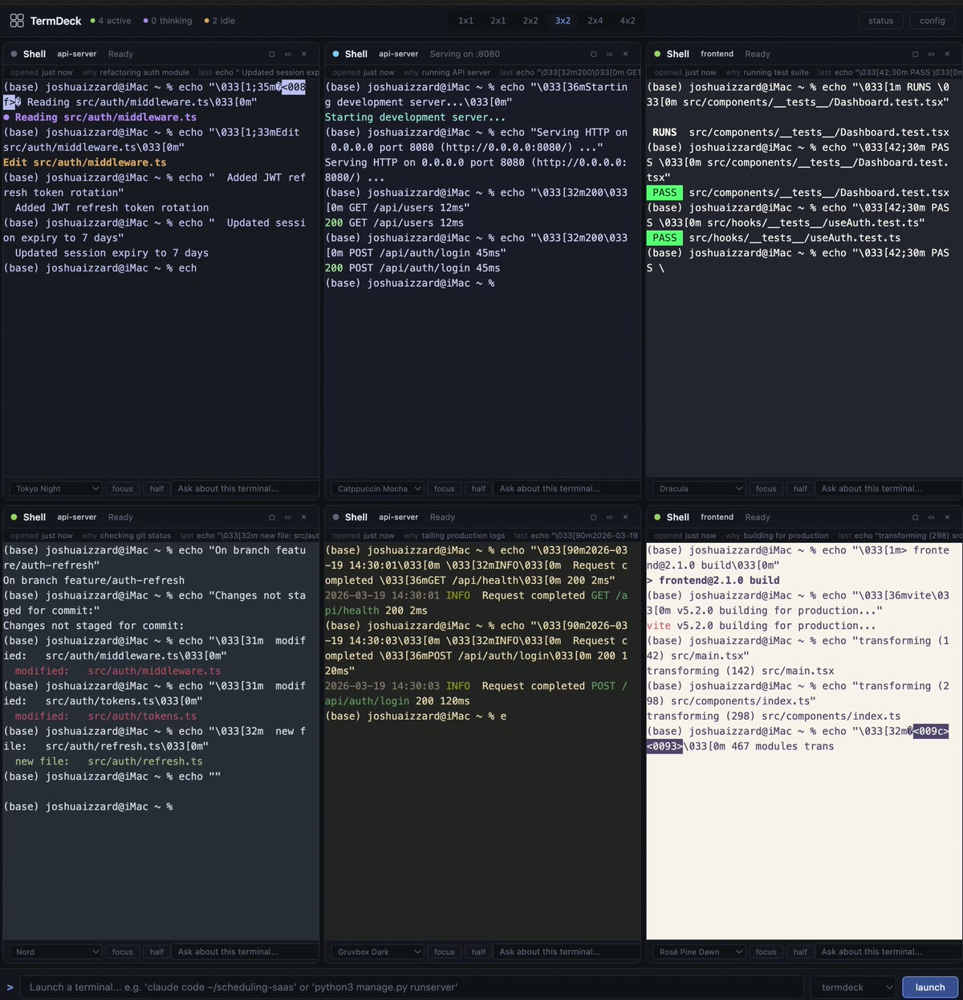
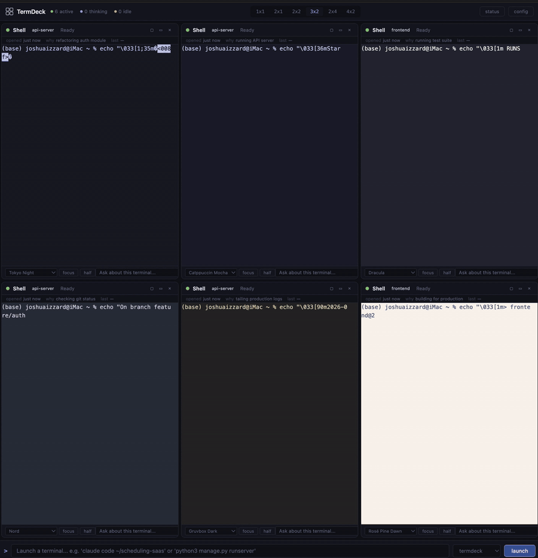

# TermDeck



Web-based terminal multiplexer with AI-aware session management, rich metadata overlays, and cross-project RAG integration.

Think of it as tmux in your browser — but each terminal panel shows you what project it belongs to, what the AI is doing, and pipes everything into your memory system.



## Install

```bash
git clone https://github.com/jhizzard/termdeck.git
cd termdeck
npm install
```

### Prerequisites

TermDeck uses [node-pty](https://github.com/nicholasrq/node-pty) for real terminal emulation. This requires a C++ compiler for your platform:

- **macOS**: `xcode-select --install` (installs Xcode Command Line Tools)
- **Windows**: Install [Visual Studio Build Tools](https://visualstudio.microsoft.com/visual-cpp-build-tools/) with the "Desktop development with C++" workload
- **Linux (Debian/Ubuntu)**: `sudo apt install build-essential python3`
- **Linux (Fedora)**: `sudo dnf groupinstall "Development Tools"`

If `npm install` fails with errors mentioning `node-gyp`, `gyp`, or `node-pty`, you're missing the compiler.

### macOS
```bash
npm run install:app
# Creates ~/Applications/TermDeck.app — double-click to launch, drag to Dock
```

### Windows
```cmd
install.bat
# Creates Start Menu + Desktop shortcuts
```

### Linux
```bash
npm run dev
# Or: node packages/cli/src/index.js
```

No terminal needed after installation — TermDeck opens your browser automatically.

## What it does

TermDeck gives you a single browser window with multiple embedded terminal panels. Each panel is a real PTY — full ANSI/VT100 support, so Claude Code, Gemini CLI, vim, htop, and any other terminal app works exactly as it would in a native terminal.

Each terminal panel has:

- **Status indicator** — green (active), purple (thinking), amber (idle), red (errored)
- **Type detection** — automatically identifies Claude Code, Gemini CLI, Python servers, or plain shells
- **Project tag** — color-coded project association
- **Metadata strip** — when opened, why, last commands, detected ports, request counts
- **Individual controls** — theme selector, focus/half/close, AI question input
- **Per-terminal theming** — Tokyo Night, Rose Pine Dawn, Catppuccin, Dracula, Nord, and more

## Layout modes

Designed for iMac-scale screens. Layout modes let you see the right amount of detail:

| Mode | Grid | Use case |
|------|------|----------|
| 1x1 | Single terminal | Deep work with one AI agent |
| 2x1 | Two columns | Half-screen split |
| 2x2 | 2x2 grid | Four terminals at comfortable size |
| 3x2 | 3x2 grid | Six terminals, monitoring mode |
| 2x4 | 2x4 grid | Eight terminals, tall vertical pairs |
| 4x2 | 4x2 grid | Eight terminals, control room |
| Focus | One expanded | Temporarily expand any panel |
| Half | One large + stack | One primary + secondary panels |

## Prompt bar

The bottom prompt bar launches new terminals:

```
> bash                              # Plain shell
> claude code ~/my-project          # Claude Code in a directory
> python3 manage.py runserver       # Django dev server
> cc my-project                     # Shorthand: Claude Code + project
> gemini                            # Gemini CLI
> npx vitest run                    # One-shot command
```

Select a project from the dropdown to auto-tag and auto-`cd` into the project directory.

## Configuration

The installer creates `~/.termdeck/config.yaml`. Edit it to define your projects:

```yaml
port: 3000
shell: /bin/zsh
defaultTheme: tokyo-night

projects:
  my-project:
    path: ~/code/my-project
    defaultTheme: catppuccin-mocha
    defaultCommand: claude

rag:
  enabled: false
  supabaseUrl: https://your-project.supabase.co
  supabaseKey: your-anon-key
```

## RAG integration

TermDeck has a three-layer memory system:

1. **Session memory** — what happened in each terminal session
2. **Project memory** — commands, file edits, and patterns shared across sessions within a project
3. **Developer memory** — cross-project patterns (your habits, common workflows, error resolutions)

Events are always recorded to local SQLite (`~/.termdeck/termdeck.db`). Enable Supabase sync by adding your credentials to the config file and running `config/supabase-migration.sql` in your Supabase SQL editor.

## Keyboard shortcuts

| Shortcut | Action |
|----------|--------|
| Ctrl+Shift+N | Focus prompt bar |
| Ctrl+Shift+1 | Layout: 1x1 |
| Ctrl+Shift+2 | Layout: 2x1 |
| Ctrl+Shift+3 | Layout: 2x2 |
| Ctrl+Shift+4 | Layout: 3x2 |
| Ctrl+Shift+5 | Layout: 2x4 |
| Ctrl+Shift+6 | Layout: 4x2 |
| Ctrl+Shift+] | Next terminal |
| Ctrl+Shift+[ | Previous terminal |
| Escape | Exit focus/half mode |

## Architecture

```
Browser (xterm.js panels)
    | WebSocket (1 per terminal)
Node.js server
    |-- Session manager (create, destroy, metadata)
    |-- WebSocket hub (mux terminal I/O)
    |-- REST API (CRUD, resize, themes)
    |-- Output analyzer (status detection)
    |-- RAG event recorder (SQLite + Supabase sync)
        | node-pty
OS pseudo-terminals
    |-- bash/zsh
    |-- Claude Code
    |-- python3 servers
    |-- Gemini CLI
    |-- any CLI tool
        |
SQLite (local) --sync--> Supabase (RAG)
```

## Security

TermDeck gives each terminal panel full shell access on your machine. It binds to `127.0.0.1` (localhost only) by default.

**Do NOT expose TermDeck to the network without authentication.** There is no built-in auth in v0.1. If you need remote access, put it behind a VPN or SSH tunnel.

## Tech stack

- **Server**: Node.js, Express, node-pty, ws, better-sqlite3
- **Client**: xterm.js, xterm-addon-fit, vanilla JS (no build step)
- **Storage**: SQLite (local), Supabase/PostgreSQL (RAG)
- **Themes**: 8 curated terminal color schemes
- **Launch**: macOS .app bundle (no terminal needed)

## How to test

After installing, verify each feature works:

1. **Launch** — Double-click TermDeck.app or run `npm run dev`. Browser should open automatically.
2. **Create terminals** — Type `bash` in the prompt bar and click Launch. Verify the terminal is interactive (`ls`, `pwd`, `echo hello`).
3. **Multiple terminals** — Open 4+ terminals. Verify they're independent.
4. **Layouts** — Click each layout button (1x1 through 4x2). Try Ctrl+Shift+1-6.
5. **Focus/Half** — Click the focus (square) and half (rectangle) buttons on a panel. Press Escape to exit.
6. **Keyboard nav** — Use Ctrl+Shift+] and [ to cycle between terminals.
7. **Metadata** — Run commands and verify "last command" updates in the metadata strip.
8. **Port detection** — Run `python3 -m http.server 8888`. Verify port shows in metadata and type changes to "Python Server".
9. **Themes** — Change themes on two terminals independently via the dropdown.
10. **Projects** — Select a project from the dropdown, launch a terminal. Verify it cd's to the right directory.
11. **Terminal exit** — Type `exit` in a terminal. Panel should dim with "Exited (0)".
12. **Persistence** — Restart the server. Old sessions should be marked as exited in the DB.
13. **Command history** — Check `GET http://localhost:3000/api/sessions/:id/history`.
14. **RAG events** — Check `GET http://localhost:3000/api/rag/events` to see recorded events.

## Development

```bash
# Install dependencies
npm install

# Run server directly
npm run server

# Run via CLI (opens browser)
npm run dev

# The client is served as static files from packages/client/public/
```

## Troubleshooting

### `npm install` fails with node-gyp errors

Install the C++ compiler for your platform (see Prerequisites above), then:

```bash
npm cache clean --force
rm -rf node_modules package-lock.json
npm install
```

### Terminal panels don't respond to input

Check that node-pty compiled correctly:

```bash
node -e "require('node-pty')"
```

If this throws an error, reinstall with: `npm rebuild node-pty`

## License

MIT
