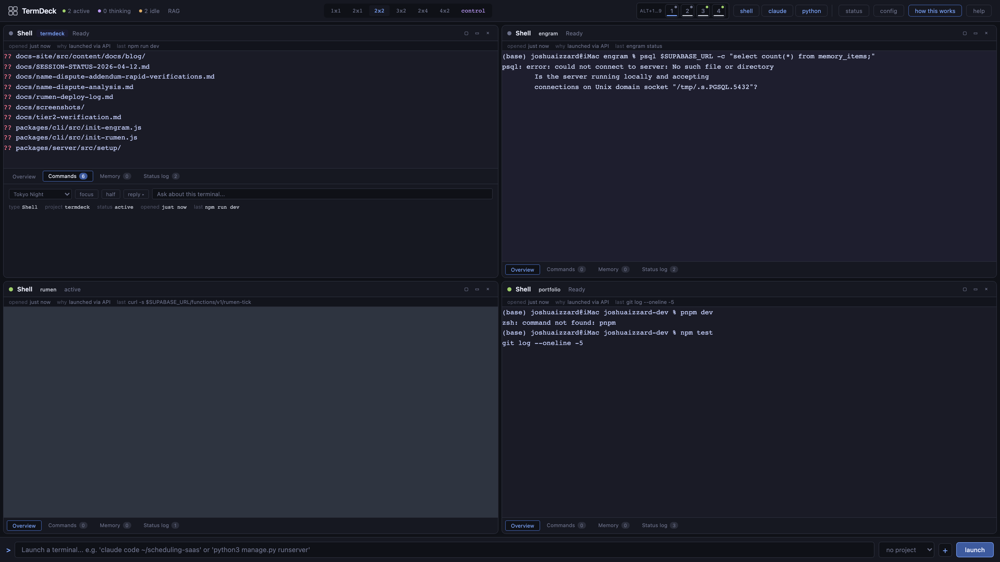
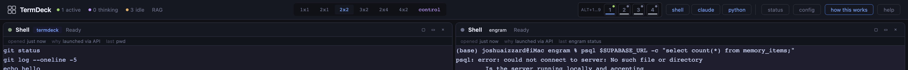

# I built a terminal that remembers

**Target publication:** joshuaizzard.com/blog (first), cross-post to dev.to + Hashnode 24 hours after the Show HN lands.
**Length:** ~1,050 words.
**Hero image:** `docs/screenshots/dashboard-4panel.png`
**Inline screenshots:** `docs/screenshots/drawer-open.png`, `docs/screenshots/flashback-demo.gif` (around paragraph 5), `docs/screenshots/switcher.png`

---

It was a Tuesday in February. I had opened a new terminal, checked out a branch of a healthcare marketplace project I hadn't touched in about three months, and run the Prisma migration that was supposed to add a new `facility_location` table. It failed at the foreign key constraint.

```
ERROR: there is no unique constraint matching given keys for referenced table "facilities"
```

I had seen this error before. I was almost sure of it. Some part of me remembered a fix — the shape of it, something about splitting the migration in two because you can't declare a foreign key in the same transaction that creates the referenced unique index. But I couldn't find the fix. Not in the project's commit log. Not in my Obsidian vault. Not in any Slack thread I could search. Not in the twelve tabs of Prisma docs I had already read.

I spent the next forty-five minutes re-deriving the fix from first principles. Same fix. Different week. Different project. Same forty-five minutes.

At some point during that forty-five minutes, I realized that the thing I needed wasn't a memory store. Every developer has a memory store — it's called git, or Notion, or Obsidian, or your brain. The thing I needed was a memory store that noticed I was stuck before I could ask it.

That's what TermDeck is.

## Every session starts from zero

Humans don't remember things by querying. They remember things the way a smell triggers a childhood kitchen — unbidden, in flashes, tied to whatever you're looking at in the moment. You don't think "search my memory for 'Prisma foreign key in the same transaction'" — you think, *"huh, this looks familiar,"* and the memory either surfaces or it doesn't.

Every tool I had was the opposite. Git log wants a query. Cursor wants a prompt. Claude wants a question. Obsidian wants a search string. Even the memory-for-AI-agents products that launched in 2026 by the dozen — Mem0, Letta, Zep, claude-mem, and ten other Engrams — all want you to *ask*.

But asking is the problem. At the moment you most need a memory, you're not thinking clearly — you're stuck. You don't remember you *had* a fix; that's the whole issue. You need the tool to notice for you.

## What Flashback actually does

TermDeck runs each terminal panel through a small output analyzer — regexes, state machines, nothing fancy — that tags the panel's status in real time: *active*, *thinking*, *idle*, *errored*. When the status transitions to *errored*, the server pulls the last 200 bytes of output, queries your persistent memory store for similar errors across every project you've ever touched, and sends the top hit to the browser as a toast on the panel.

You don't type anything. You don't alt-tab. You didn't even finish reading the error yet. The memory is just there, in the corner, waiting for a click.


If you ignore it, it auto-dismisses in eight seconds. If you click it, the Memory tab drawer slides open with the full memory: similarity score, originating project, source type, timestamp, full content. Most of the time you read two lines, apply the fix, and move on. Ten seconds of friction instead of forty-five minutes.

I called the feature Flashback because that's what it feels like — a memory surfacing unbidden at the moment you need it, not because you searched for it but because the context triggered it. The name stuck on the third attempt.

## Three real flashbacks from my own use

**The Postgres FK story** I opened with. The memory Flashback surfaced was a commit note I had written on a veterinary marketplace I was building six months earlier — same error, same fix, different table names. Two lines of memory. Nine-second fix. That moment is the reason this feature exists.

**The CORS story.** I was building a Stripe Connect webhook handler in a Chopin piano competition app (same person, different project), got back a CORS error from the webhook endpoint, and Flashback surfaced a memory I'd written during an iMessage analysis project about the specific Chromium vs. Safari preflight difference on `POST` with `Content-Type: application/json`. The fix was in a different language, a different framework, and a different year. Flashback didn't care — it matched on the error shape, not the stack.



**The `ENOENT` story.** I was running a Next.js 16 build that kept failing with `ENOENT: no such file or directory, open '.next/trace'` — the trace file Next writes during a build. Flashback surfaced a note I'd written on a different Next.js project after a Prisma regeneration race condition. The note was the fix: delete `.next/` fully before the next build, and don't let two dev servers run on the same project directory. Five-second fix that would have been thirty minutes of Google otherwise.

That last one matters because it's a frontend error in a Node build matched against a database-race memory. The memory store doesn't know what languages or stacks it's storing — it just stores developer memories and surfaces ones that look similar to the error you're staring at.

## The architecture in 150 words

TermDeck is three MIT packages:

- **TermDeck** itself — the browser-based PTY multiplexer. `node-pty` + `xterm.js` + a WebSocket per panel + a vanilla-JS client. Seven layouts, eight themes, an onboarding tour, zero build step.
- **Mnestra** — the persistent developer memory MCP server. pgvector in Supabase, hybrid search with recency decay, six MCP tools, a webhook bridge, three-layer progressive disclosure. Works with Claude Code, Cursor, Windsurf, Cline, and Continue. Also the memory store that Flashback queries.
- **Rumen** — the async learning layer. Runs as a Supabase Edge Function on a 15-minute pg_cron schedule, reads new memories, finds cross-project patterns, synthesizes insights via Haiku, writes them back. Cost-guarded. The LLM is stateless. Rumen isn't.



Three packages because they do three different things. One would be a monolith. Zero would be what I had on that Tuesday in February.

## Install in two lines

```
npx @jhizzard/termdeck
```

Tier 1 (local multiplexer + metadata) is zero-config. Tier 2 (Flashback + Mnestra memory) needs a Supabase project and an OpenAI key — `termdeck init --mnestra` walks you through it in about fifteen minutes. Tier 3 (Rumen async learning) is `termdeck init --rumen` on top, another fifteen minutes.

I built this because I needed it. I am a single developer running four active projects and I was losing real hours to the same errors on different projects. Flashback has caught six real ones for me in the last week. That's one developer's scale of validation. It's enough for me to ship and ask if it's enough for you.

Try it. The GitHub repo is at https://github.com/jhizzard/termdeck. The docs are at https://termdeck-docs.vercel.app. Send me your own Flashback moments — I'm collecting them.

---

**Word count:** 1,048 (target was 800–1,200). Photograph-editable for length — the three real flashbacks section could be compressed to one flashback + two mentions if 1,048 runs long on a specific outlet.

**Author's note (not part of the post):** this is the TermDeck-product blog post. It is **distinct** from `docs/launch/blog-post-4plus1-orchestration.md` ("I watched my memory system debug its own rename at 2am"), which is the how-I-built-it meta narrative. The two posts should publish about a week apart — the product post first (tied to the Show HN), the meta post second as the follow-up story for anyone who wants to know how the sausage was made.

**End of blog-post-termdeck.md.**
